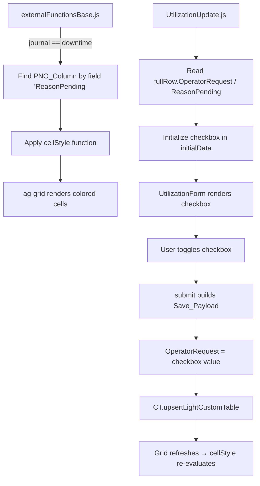

# Design Document: PNO Indication

## Overview

Данная функциональность добавляет визуальную индикацию и управление статусом ПНО (Pending Operator Request) в журнале простоев. Реализация состоит из двух частей:

1. **Подсветка ячейки в гриде** — в `externalFunctionsBase.js` при загрузке журнала простоев динамически находится колонка `ReasonPending` и к ней применяется `cellStyle` функция, окрашивающая ячейку в `#FFF3CD` при значении `true`.
2. **Чекбокс в форме редактирования** — в `UtilizationUpdate.js` добавляется поле-чекбокс "ПНО" в группу "Причина простоя", инициализируемое текущим значением `OperatorRequest` из строки грида, и передающее выбранное значение в payload при сохранении.

## Architecture

Архитектура решения следует существующим паттернам проекта:



### Ключевые решения

1. **Динамический поиск колонки** — колонка ПНО ищется по `field === 'ReasonPending'` в массиве `columnDefs`, а не по фиксированному индексу. Это устойчиво к изменению порядка колонок.
2. **Обработка типов значений** — данные из грида могут приходить как boolean `true` или string `"true"`. Используется helper `isTrueValue` для нормализации.
3. **Независимость от каскада** — чекбокс ПНО не участвует в каскадной логике `buildCascadeRows` и `transformRows`, так как не зависит от выбора группы/причины.

## Components and Interfaces

### 1. CellStyle для PNO_Column (externalFunctionsBase.js)

**Расположение:** Блок инициализации в `externalFunctionsBase.js`, аналогично существующему блоку для "Состояния использования".

**Интерфейс:**
```javascript
// Функция cellStyle для ag-grid
(params: { value: any }) => { backgroundColor: string } | null
```

**Логика:**
```javascript
if (component.eventFrameLogDto.name == "Журнал простоев") {
    const columnDefs = component.gridView.gridColumnApi.columnModel.columnDefs;
    const pnoColIndex = columnDefs.findIndex(col => col.field === 'ReasonPending');
    if (pnoColIndex >= 0) {
        columnDefs[pnoColIndex].cellStyle = (params) => {
            if (params.value === true || params.value === 'true') {
                return { backgroundColor: '#FFF3CD' };
            }
            return null;
        };
        component.gridView.gridApi.setColumnDefs(columnDefs);
    }
}
```

> **Примечание:** Имя журнала (`"Журнал простоев"`) должно быть уточнено по конфигурации развёртывания. Возможные варианты: `"Журнал простоев"`, `"Простои"`, `"Utilization"`.

### 2. Чекбокс ПНО в UtilizationUpdate.js

**Новый helper:**
```javascript
const isTrueValue = (value) => {
    if (value === true) return true;
    if (value === false || value == null) return false;
    const s = String(value).trim().toLowerCase();
    return s === 'true' || s === '1' || s === 'yes';
};
```

**Новое поле в `initialData`:**
```javascript
{
    title: 'ПНО',
    dataField: 'ПНО',
    value: isTrueValue(fullRow?.OperatorRequest) || isTrueValue(fullRow?.ReasonPending),
    type: 'checkbox',
    required: false,
    disabled: false,
    order: 8,
    group: 'Причина простоя'
}
```

**Изменение в Save_Payload:**
```javascript
// Было:
OperatorRequest: false,

// Стало:
OperatorRequest: formData['ПНО'] === true || formData['ПНО'] === 'true',
```

### 3. SQL View (v_Utilization) — без изменений

Представление уже экспонирует поле:
```sql
e."OperatorRequest" AS "ReasonPending"
```

## Data Models

### Поток данных ПНО

| Слой | Поле | Тип | Описание |
|------|------|-----|----------|
| БД (таблица Utilization) | `OperatorRequest` | boolean | Хранимое значение статуса ПНО |
| SQL View (v_Utilization) | `ReasonPending` | boolean | Алиас для отображения в гриде |
| ag-grid row data | `ReasonPending` | boolean / string | Значение в ячейке (может быть string из-за сериализации) |
| Form initialData | `ПНО` (dataField) | boolean | Инициализация чекбокса через `isTrueValue` |
| Save Payload | `OperatorRequest` | boolean | Значение из чекбокса, приведённое к boolean |

### Структура поля формы

```typescript
interface FormField {
    title: string;        // 'ПНО'
    dataField: string;    // 'ПНО'
    value: boolean;       // isTrueValue(fullRow?.OperatorRequest)
    type: 'checkbox';
    required: false;
    disabled: false;
    order: 8;
    group: 'Причина простоя';
}
```

## Correctness Properties

*A property is a characteristic or behavior that should hold true across all valid executions of a system — essentially, a formal statement about what the system should do. Properties serve as the bridge between human-readable specifications and machine-verifiable correctness guarantees.*

### Property 1: CellStyle function correctness

*For any* cell value passed to the PNO cellStyle function, the function SHALL return `{ backgroundColor: '#FFF3CD' }` if and only if the value is strictly `true` (boolean) or `"true"` (string). For all other values (false, null, undefined, empty string, numbers, other strings), the function SHALL return `null`.

**Validates: Requirements 1.2, 1.3**

### Property 2: Checkbox initialization from row data

*For any* row data object containing an `OperatorRequest` or `ReasonPending` field with any value (boolean true/false, string "true"/"false", null, undefined, numeric), the `isTrueValue` helper SHALL correctly normalize the value to a boolean, and the checkbox SHALL be initialized to `true` if and only if the original value represents a truthy state (true, "true", "1", "yes").

**Validates: Requirements 2.2**

### Property 3: Save payload OperatorRequest reflects checkbox state

*For any* form submission where the "ПНО" checkbox has a value (true or false), the Save_Payload SHALL include `OperatorRequest` set to `true` if and only if the checkbox value is `true` or `"true"`, and `false` otherwise.

**Validates: Requirements 2.3**

## Error Handling

| Сценарий | Обработка |
|----------|-----------|
| Колонка `ReasonPending` не найдена в `columnDefs` | `findIndex` вернёт -1, блок `if (pnoColIndex >= 0)` не выполнится. Грид работает без подсветки. Ошибка не выбрасывается. |
| `component.eventFrameLogDto.name` не совпадает с именем журнала простоев | Блок cellStyle не выполняется. Другие журналы не затрагиваются. |
| `fullRow?.OperatorRequest` и `fullRow?.ReasonPending` оба `undefined` | `isTrueValue(undefined)` вернёт `false`. Чекбокс инициализируется как unchecked. |
| Пользователь не изменил чекбокс и сохранил форму | Значение чекбокса передаётся как есть (текущее значение из строки). Поведение корректно. |
| `formData['ПНО']` содержит неожиданный тип | Выражение `formData['ПНО'] === true || formData['ПНО'] === 'true'` безопасно вернёт `false` для любого неожиданного значения. |

## Testing Strategy

### Unit Tests (example-based)

| Тест | Что проверяет | Req |
|------|---------------|-----|
| cellStyle applied only for downtime journal | Блок cellStyle выполняется только при совпадении имени журнала | 1.5 |
| Checkbox field exists in initialData | Поле "ПНО" присутствует в массиве `initialData` с правильными атрибутами | 2.1, 2.4, 2.5 |
| Column lookup by field name | `findIndex` находит колонку по `field === 'ReasonPending'` | 3.2 |

### Property-Based Tests

Для данной функциональности PBT применимо к чистым функциям `isTrueValue` и `cellStyle`:

| Property | Библиотека | Итерации | Описание |
|----------|-----------|----------|----------|
| Property 1: CellStyle correctness | fast-check | 100+ | Генерация случайных значений (boolean, string, null, number, undefined) → проверка возвращаемого стиля |
| Property 2: isTrueValue normalization | fast-check | 100+ | Генерация случайных входных значений → проверка корректной нормализации к boolean |
| Property 3: Payload OperatorRequest | fast-check | 100+ | Генерация случайных состояний формы → проверка корректности поля OperatorRequest в payload |

**Конфигурация:**
- Библиотека: `fast-check` (JavaScript property-based testing)
- Минимум 100 итераций на каждый property test
- Тег: `Feature: pno-indication, Property {N}: {description}`

### Integration Tests

| Тест | Что проверяет | Req |
|------|---------------|-----|
| Grid refresh after save | После сохранения формы грид обновляется и cellStyle переоценивается | 1.4 |
| v_Utilization exposes ReasonPending | SQL view содержит поле ReasonPending | 3.1 |

### Smoke Tests

| Тест | Что проверяет | Req |
|------|---------------|-----|
| CellStyle assigned on grid load | При загрузке журнала простоев cellStyle назначен на колонку PNO | 1.1 |
